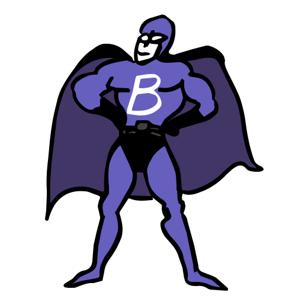

# brandapplause.com


## Development

Building the project requires [Node.js](https://nodejs.org/en/) and Webpack.

```bash
# Install dependencies
npm ci
```

```bash
# Run development server
npm run dev
```
